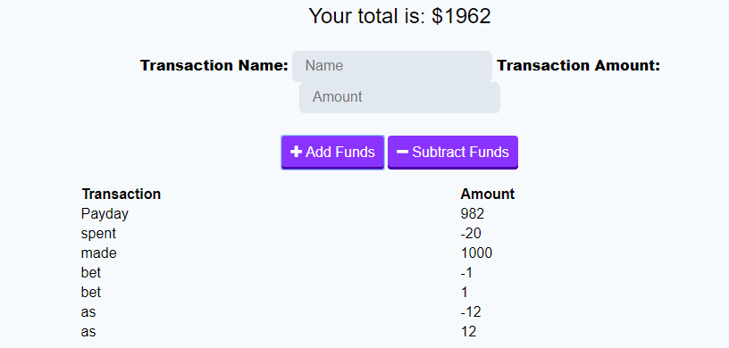

# Progressive Budget

The Progressive Budget app is designed to help users track their finicial transactions on an easy to read graph. User will be able to name their transactions and track their progress daily. 

Users will be able to use the app via the link provide here: https://limitless-sea-69514.herokuapp.com/. By visiting the online site, users will also be able to install the application on their personal devices through their brower setting.

Once the application is installed, users will be able to have their own personal budget tracker on any of the personal desktop or laptop devices.

# Budget in Work

Users can type in the name of their transaction above and view the total about of their budget. Users can then either add or subtract the amount they inputed in the information field. The transaction will then be display along with other past transaction the user has placed.

User can have an visual representation of their budget via the graph pictured above. Along with each point along the graph, the user can see the dates that they inputed the new transaction information within the budget tracker.

# Future Development

Some of the future developments in mind for this app is to add both a delete and clear all function to the table. The idea is to allow the users to remove any misinformation that they have type into the app. The clear all function will allow the user to wipe out the entire table of information.

Another development I would like to work on is include a pre-selection of different types of generic transactions that will allow to user to better track their different transactions.